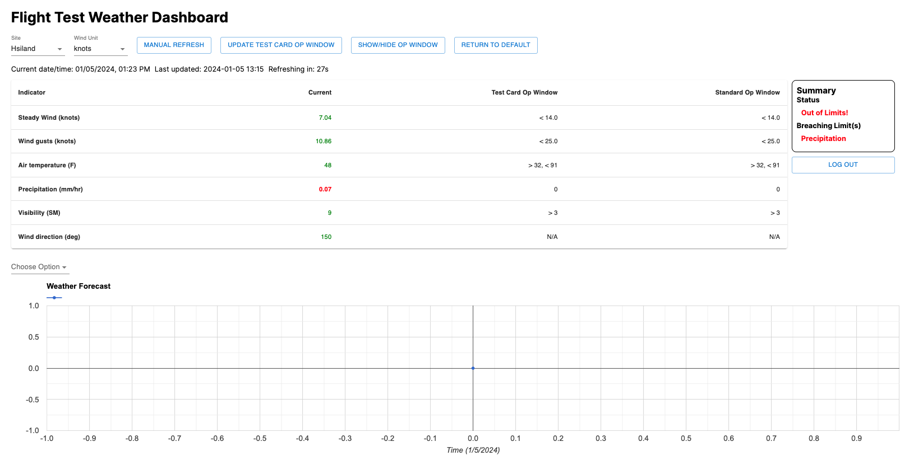
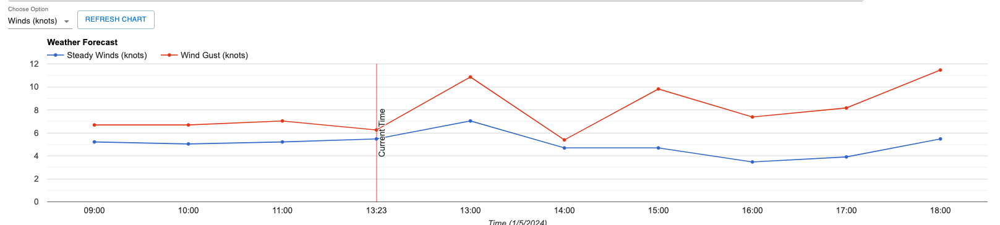
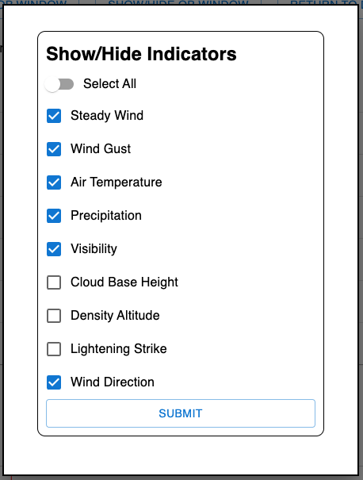
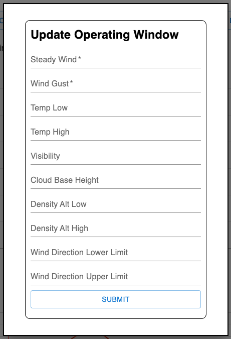
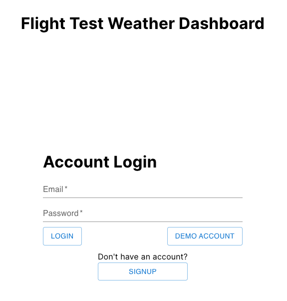
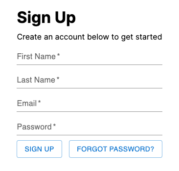

# Aviation Weather Dashboard

Welcome to the Aviation Weather Dashboard. This dashboard provides up-to-date weather information and compares it with the specified operating parameters. Based on this comparison, it delivers a clear "Go" or "No-Go" decision for users.

# Deployment

- Frontend deployed on [Netlify](https://flight-test-weather-dashboard.netlify.app/)
- Backend deployed on [Heroku](https://weather-dashboard-server-8642d019957b.herokuapp.com)
- Backend [Github](https://github.com/jaylee1021/weather-dashboard-server)

# Built with

# Preview Screen

## Mainpage

- User can select one of the pre-inserted `sites`. (Adding/deleting new sites will be added in future)
- `Wind unit` can be switched between knots and m/s.
- The website saves users' site selection and wind unit preferences in local storage, ensuring that when the users return, they can pick up right where they left off.
- `Manual Refresh` button fetches the weather data from the API and updates it on the page instantly.
- `Return To Default` button returns the 'Test Card Op Window' to default values.
- Based on the compareson between current weather and Test Card Op window, user will see `Go` or `No-Go` and breaching limit on the right of the screen.\

## Chart

- Utilizing Google Chart for react to show 3 hours back and 7 hours of forecast selected weather.

## Show/Hide Op Window

- User can pick and choose which criteria to show on the main page. If a criteria is hidden, it won't affect Go or No-Go.

## Update Op Window

- User can change the Test Card Op Window for different test cards.

## Login / Signup

- User can either signup and login or use demo account to use the dashboard.
- Each user data is saved in MongoDB database.
- Test Card Op Window is saved on each user profile. So every user can have different op window.

 

# Features in progress

- ~~Add current and forecasted air quality~~
- Dark mode feature
- Add or remove sites with lat and long coordinates
- Add or remove weather indicators
- Add op window on chart

# Limitation

- Due to limitation weather source from Weather API, not all applicable aviation weather data are available.

# Sources

- [Weather API](https://www.weatherapi.com/): Provides current weather and refreshes every 15 mins. Also, provides 48 hour weather forecast.
- [Air Quality API (Open-Meteo)](https://open-meteo.com/): Provides current and forecasted air quality data.
